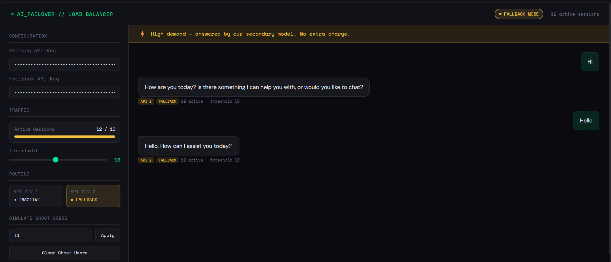

# Groq API Failover Load Balancer

A demand-aware API router that automatically switches between two Groq API keys when concurrent traffic exceeds a configurable threshold — inspired by how Google Gemini handles high-demand periods.

When the active session count crosses the threshold, new requests silently route to the secondary key. Users see a friendly "high demand" notice. No request is dropped.

---

## How it works

```
User Request
     │
     ▼
┌─────────────────────────────────┐
│   Express Load Balancer         │
│   active sessions >= threshold? │
└──────┬──────────────────────────┘
       │
   ┌───┴────┐
  No       Yes
   │         │
   ▼         ▼
API Key 1  API Key 2
(primary)  (fallback)
   │         │
   └────┬────┘
        ▼
  Response + optional
  "high demand" banner
```

If the primary key also throws a `429` or `5xx`, the router **emergency-falls back** to Key 2 regardless of load — combining proactive and reactive failover.

---

## Features

- **Zero dropped requests** — always routes to one of two keys
- **Emergency fallback** — switches on `429`/`5xx` even below threshold
- **Interactive frontend** — built-in chat UI to test the system live
- **Gemini-style demand banner** — yellow notice when fallback is active
- **Ghost user simulator** — fake concurrent traffic without real load
- **Live traffic bar + routing log** — see exactly which API handled each request
- **Adjustable threshold** — slider from 1–20, applied per-request in real time
- **Session TTL tracking** — expired sessions auto-evict after 30 seconds

---

## Frontend

The project ships with a full chat UI built using vanilla HTML/CSS/JS — **designed with AI assistance**.



Key UI panels:
- **Configuration** — paste your two Groq API keys directly in the browser (never stored)
- **Traffic** — live progress bar showing active sessions vs threshold
- **Routing** — shows which API key is currently active (PRIMARY / FALLBACK)
- **Simulate Ghost Users** — inject fake concurrent users to trigger failover on demand
- **Request Log** — per-message log showing which API handled each request

---

## Getting started

### Prerequisites

- [Node.js](https://nodejs.org) v18 or later
- Two [Groq API keys](https://console.groq.com) (free account, create two separate keys)

### 1. Clone and install

```bash
git clone https://github.com/Darsh-Nandu/ai-failover.git
cd ai-failover
npm install
```

### 2. Configure your keys

**Option A — `.env` file (recommended for local dev)**

```bash
cp .env.example .env   # or create .env manually
```

```env
GROQ_KEY_1=gsk_your_primary_key_here
GROQ_KEY_2=gsk_your_fallback_key_here
THRESHOLD=10
PORT=3000
```

**Option B — Enter keys in the UI**

Leave `.env` empty and paste your keys directly into the Configuration panel in the browser. They're sent per-request and never stored anywhere.

### 3. Start the server

```bash
node node-backend.js
```

```
Load balancer running on http://localhost:3000
Threshold: 10 active users
Keys loaded: Key1=true, Key2=true
Frontend: http://localhost:3000/index.html
```

### 4. Open the UI

Visit **[http://localhost:3000](http://localhost:3000)** in your browser.

---

## Testing the failover

You don't need 10 real users to trigger the fallback. Use the built-in ghost user simulator:

1. Open the app and enter your API keys
2. Set the **Threshold** slider to something low, like `3`
3. Set **Ghost Users** to `4` and click **Apply**
4. Send any message — it will route to API 2 and show the yellow fallback banner
5. The request log on the left will confirm which API handled it

### Running the unit tests

```bash
node test.js
```

The test suite covers routing logic, session tracking (including TTL expiry), ghost user simulation, edge cases, and response shape validation — no API keys or running server needed.

```
=== Routing Logic ===
  ✓  below threshold → uses primary key
  ✓  at threshold → uses fallback key
  ✓  above threshold → uses fallback key
  ...

=== Session Tracking ===
  ✓  expired sessions are evicted
  ✓  re-registering a session resets its TTL
  ...

──────────────────────────────────────────
  20 tests: 20 passed, 0 failed
──────────────────────────────────────────
```

---

## API reference

### `POST /api/chat`

Send a message through the load balancer.

**Request body**

| Field | Type | Required | Description |
|---|---|---|---|
| `message` | string | ✓ | The user's message |
| `key1` | string | if no `.env` | Primary Groq API key |
| `key2` | string | if no `.env` | Fallback Groq API key |
| `threshold` | number | no | Override the env threshold for this request |

**Request headers**

| Header | Description |
|---|---|
| `x-session-id` | Unique session ID for concurrency tracking |
| `x-ghost-users` | Number of simulated extra users to add to the count |

**Response**

```json
{
  "reply": "Hello! How can I help you?",
  "usedFallback": false,
  "activeUsers": 4,
  "threshold": 10,
  "notice": null
}
```

When `usedFallback` is `true`, `notice` contains a user-facing message.

---

### `GET /api/status`

Returns current load balancer state. Useful for monitoring dashboards.

```json
{
  "activeUsers": 4,
  "threshold": 10,
  "currentApi": 1,
  "isFallbackMode": false
}
```

---

## File structure

```
ai-failover/
├── index.html          # Frontend chat UI (vanilla HTML/CSS/JS, AI-assisted)
├── node-backend.js     # Express server — routing, session tracking, Groq calls
├── test.js             # Unit test suite (no dependencies)
├── package.json
├── .env.example        # Environment variable template
├── README.md
└── docs/
    ├── architecture.md # Deep dive on routing logic and design decisions
    └── simulate.md     # Guide to traffic simulation methods
```

---

## Core routing logic

```javascript
// One decision: is load at or above threshold?
const chosenKey = activeUsers >= threshold ? key2 : key1;
const isFallback = chosenKey === key2;

// Emergency fallback: retry on primary failure regardless of load
if (!isFallback && (err.status === 429 || err.status >= 500)) {
  const reply = await callGroq(key2, message); // silently retry
}
```

The API call itself is identical — only the key changes. That's the whole pattern.

---

## Extending this

**Redis-backed counter** — for multi-instance deployments where each Node process has its own in-memory map:

```javascript
// Replace activeSessions Map with Redis INCR/EXPIRE
await redis.set(`session:${sessionId}`, 1, 'EX', 30);
const activeUsers = await redis.keys('session:*').then(k => k.length);
```

**Third key / circuit breaker:**

```javascript
const keys = [key1, key2, key3];
const tier = Math.min(Math.floor(activeUsers / threshold), keys.length - 1);
const chosenKey = keys[tier];
```

**Key health checks** — pre-flight ping before routing to catch invalid/expired keys.

---

## Contributing

PRs welcome. Most wanted:

- Redis-backed concurrency for multi-process deployments
- Automatic key health checks
- Analytics dashboard for fallback rate over time
- Streaming response support (`text/event-stream`)

---

## License

MIT