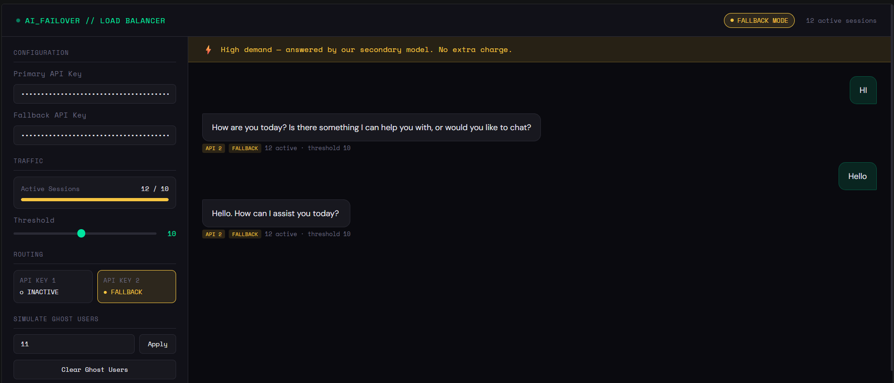

<div align="center">

# ⟳ AI Failover

**Demand-aware AI API router with automatic failover**

Inspired by how Google Gemini silently handles high-demand periods - routes to a secondary API key when concurrent traffic crosses a threshold. Zero dropped requests.

<br/>

[](https://darsh-nandu.github.io/ai-failover/)
[](https://github.com/Darsh-Nandu/ai-failover/actions)
[](https://nodejs.org)
[](LICENSE)

<br/>



</div>

---

## How it works

```
         User Request
               │
               ▼
  ┌────────────────────────┐
  │      Load Balancer     │
  │  active >= threshold?  │
  └──────────┬─────────────┘
             │
        ┌────┴────┐
       No        Yes
        │          │
        ▼          ▼
    API Key 1   API Key 2
    (primary)   (fallback)
        │          │
        └────┬─────┘
             ▼
    Response + "high demand"
    banner if fallback used
```

If the primary key hits a `429` or `5xx`, the router **emergency-falls back** to Key 2 regardless of load level — combining proactive and reactive failover in one system.

---

## Features

| | Feature |
|---|---|
| 🔁 | **Zero dropped requests** - always routes to one of two keys |
| ⚡ | **Emergency fallback** - switches on `429`/`5xx` even below threshold |
| 💬 | **Interactive chat UI** - test the system live in your browser |
| 👻 | **Ghost user simulator** - inject fake concurrent load without real traffic |
| 📊 | **Live traffic bar** - see sessions vs threshold in real time |
| 🔀 | **Routing log** - per-message record of which API handled each request |
| 🎚️ | **Adjustable threshold** - slider from 1-20, applied per-request |
| ⏱️ | **Session TTL tracking** - expired sessions auto-evict after 30s |
| 🌐 | **Static demo** - runs fully in-browser on GitHub Pages, no backend needed |

---

## Quick start

### Try it instantly

→ **[darsh-nandu.github.io/ai-failover](https://darsh-nandu.github.io/ai-failover/)** — no install, runs in your browser. Bring two [Groq API keys](https://console.groq.com) (free).

### Run locally (with Express backend)

```bash
git clone https://github.com/Darsh-Nandu/ai-failover.git
cd ai-failover
npm install
cp .env.example .env   # add your Groq keys
node node-backend.js
```

Open **[http://localhost:3000](http://localhost:3000)**.

**`.env` options**

```env
GROQ_KEY_1=gsk_your_primary_key_here
GROQ_KEY_2=gsk_your_fallback_key_here
THRESHOLD=10
PORT=3000
```

> **No `.env`?** Just paste your keys directly in the UI. They're sent per-request and never stored.

---

## Testing the failover

You don't need real concurrent users. Use the built-in ghost user simulator:

1. Enter your API keys in the left panel
2. Set **Threshold** to something low - try `3`
3. Set **Ghost Users** to `4` → click **Apply**
4. Send any message - routes to API 2, yellow fallback banner appears
5. Request log confirms which key handled it

---

## Unit tests

```bash
npm test
```

22 tests covering routing logic, session TTL, ghost user simulation, edge cases, and response shape - no API keys or running server needed.

```
=== Routing Logic ===
  ✓  below threshold → uses primary key
  ✓  at threshold → uses fallback key
  ✓  above threshold → uses fallback key
  ✓  isFallback flag is set correctly

=== Session Tracking ===
  ✓  new tracker starts at 0
  ✓  expired sessions are evicted
  ✓  re-registering a session resets its TTL
  ...

──────────────────────────────────────────
  22 tests: 22 passed, 0 failed
──────────────────────────────────────────
```

---

## API reference

### `POST /api/chat`

| Field | Type | Required | Description |
|---|---|---|---|
| `message` | string | ✓ | The user's message |
| `key1` | string | if no `.env` | Primary Groq API key |
| `key2` | string | if no `.env` | Fallback Groq API key |
| `threshold` | number | - | Override env threshold for this request |

**Headers**

| Header | Description |
|---|---|
| `x-session-id` | Unique session ID for concurrency tracking |
| `x-ghost-users` | Simulated extra users to add to the count |

**Response**

```json
{
  "reply": "Hello! How can I help you?",
  "usedFallback": false,
  "activeUsers": 4,
  "threshold": 10,
  "notice": null
}
```

### `GET /api/status`

```json
{
  "activeUsers": 4,
  "threshold": 10,
  "currentApi": 1,
  "isFallbackMode": false
}
```

---

## Core logic

```javascript
// One decision point - only the key changes, not the call
const chosenKey = activeUsers >= threshold ? key2 : key1;
const isFallback = chosenKey === key2;

// Emergency fallback: retry on rate-limit or server error
if (!isFallback && (err.status === 429 || err.status >= 500)) {
  const reply = await callGroq(key2, message); // silent retry
}
```

---

## File structure

```
ai-failover/
├── index.html            # Chat UI - vanilla HTML/CSS/JS
├── node-backend.js       # Express server - routing, session tracking, Groq calls
├── static/
│   └── index.html        # GitHub Pages version - Groq called directly from browser
├── test.js               # 22-test suite, zero dependencies
├── package.json
├── .env.example
├── .github/
│   └── workflows/
│       ├── ci.yml        # Run tests on every push/PR
│       └── deploy.yml    # Deploy static/ to GitHub Pages on merge to main
└── docs/
    ├── architecture.md
    └── simulate.md
```

---

## Extending this

**Redis-backed session counter** - for multi-instance deployments:

```javascript
await redis.set(`session:${sessionId}`, 1, 'EX', 30);
const activeUsers = await redis.keys('session:*').then(k => k.length);
```

**Multi-tier routing with N keys:**

```javascript
const keys = [key1, key2, key3];
const tier = Math.min(Math.floor(activeUsers / threshold), keys.length - 1);
const chosenKey = keys[tier];
```

**Ideas for contributors:**
- Streaming response support (`text/event-stream`)
- Automatic key health checks before routing
- Analytics dashboard for fallback rate over time

---

## License

MIT